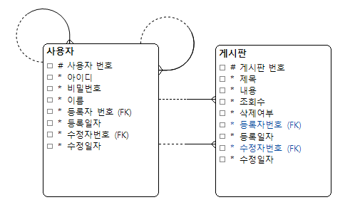

<H1>:wrench: 개발 환경</H1>
<ul>
  <li>Java 17</li>
  <li>Spring Boot 3.3.4</li>
  <li>Gradle</li>
  <li>MySQL 8.0.39</li>
  <li>AWS EC2, AWS RDS</li>
  <li>Docker</li>
</ul>

<H1>:wrench: 프로젝트 모듈 구조</H1>

<strong>mindshare</strong> (root Project)

├── <strong>common</strong> (공통 기능)

├── <strong>domain</strong> (entity 관리)

├── <strong>main</strong> (application 실행)

├── <strong>post</strong> (게시판)

├── <strong>user</strong> (사용자)

<H1>:card_index: 논리 데이터 베이스 모델(ERD)</H1>

<H1>:rocket: 프로젝트 실행 방법</H1>
<ol>
    <li>Proejct Git Clone</li>
    <li>application.yml에서 Database url, username, password 설정</li>
    <li>mindshare/MySQL_Script Download 후, MySQL Workbench에서 스크립트를 읽어서 Table/data 생성</li>
    <li>mindshare/main/src/main/java/com/hsj/aft/main/MainApplication 실행</li>
    <li>Postman을 통해 API 호출</li>
</ol>

※ AWS, Docker를 통해 배포를 했습니다. 배포 환경에서 테스트를 진행하셔도 됩니다.

<H1>:book: API 엔드포인트 목록</H1>
<H3>회원 가입</H3>
<ul>
    <li>Method: POST</li>
    <li>URL: http://54.180.102.155:80/auth/sign-up</li>
    <li>인증: 불필요</li>
    <li>설명:</li>
      <ul>
        <li>아이디, 비밀번호, 이름을 전달받아서 회원가입 진행</li>
        <li>아이디 중복 체크 진행</li>
        <li>유효성 검증 규칙</li>
          <ul>
            <li>아이디 : 필수, 4 ~ 12자, 영어와 숫자만 가능</li>
            <li>비밀번호 : 필수, 8 ~ 16자, 영문, 숫자, 특수문자 포함</li>
            <li>이름 : 필수, 2 ~ 10자</li>
          </ul>
      </ul>
    <li>Body 예시:</li>
</ul>
<pre><code>{
    "userId": "hyunsu1",
    "userPassword": "123123q!",
    "userName": "정현수"
}</code></pre>
<H3>로그인</H3>
<ul>
    <li>Method: POST</li>
    <li>URL: http://54.180.102.155:80/login</li>
    <li>인증: 불필요</li>
    <li>설명:</li>
      <ul>
        <li>아이디, 비밀번호를 전달받아서 로그인 진행</li>
        <li>세션 유효시간은 기본 설정인 30분</li>
      </ul>
    <li>Body 예시:</li>
</ul>
<pre><code>{
    "userId": "hyunsu1",
    "userPassword": "123123q!"
}</code></pre>
<H3>로그아웃</H3>
<ul>
    <li>Method: POST</li>
    <li>URL: http://54.180.102.155:80/logout</li>
    <li>인증: 필요 (로그인한 사용자만 가능)</li>
    <li>설명: 로그아웃을 통한 세션만료</li>
    <li>Body 없음</li>
</ul>
<H3>개인정보 수정</H3>
<ul>
    <li>Method: PATCH</li>
    <li>URL: http://54.180.102.155:80/user/{userNo}</li>
    <li>인증: 필요 (로그인한 사용자만 가능)</li>
    <li>설명:</li>
      <ul>
        <li>현재 비밀번호, 새 비밀번호 이름을 전달받아서 개인정보 수정</li>
        <li>본인의 정보만 수정 가능</li>
        <li>비밀번호, 이름 중 원하는 정보만 수정 가능</li>
        <li>비밀번호 : </li>
          <ul>
            <li>현재 비밀번호, 새 비밀번호 둘다 입력 필요</li>
            <li>현재 비밀번호가 일치해야 비밀번호 수정 가능</li>
            <li>현재 비밀번호와 새 비밀번호가 달라야함</li>
            <li>유효성 검증 규칙 : 필수 X, 8 ~ 16자, 영문, 숫자, 특수문자 포함</li>
          </ul>
        <li>이름 : </li>
          <ul>
            <li>이름 입력</li>
            <li>유효성 검증 규칙 : 필수 X, 2 ~ 10자</li>
          </ul>
      </ul>
    <li>Body 예시:</li>
</ul>
<pre><code>{
    "currentPassword":"123123q!",
    "newPassword":"789789q!",
    "userName":"현수"
}</code></pre>
<H3>게시글 작성</H3>
<ul>
    <li>Method: POST</li>
    <li>URL: http://54.180.102.155:80/post</li>
    <li>인증: 필요 (로그인한 사용자만 가능)</li>
    <li>설명: 제목, 내용 전달받아서 게시글 작성</li>
    <li>Body 예시:</li>
</ul>
<pre><code>{
    "title":"오늘의 독서 - '사피엔스' 읽고 있어요",
    "content":"유발 하라리의 '사피엔스'를 읽기 시작했습니다. 인류의 역사를 거시적인 관점에서 바라보는 시각이 매우 흥미롭네요. 특히 인지혁명 부분에서 언어의 발달이 인류 문명에 미친 영향에 대한 설명이 인상 깊었습니다. 함께 읽고 토론하고 싶은 분들은 댓글 남겨주세요!"
}</code></pre>
<H3>게시글 목록 조회</H3>
<ul>
    <li>Method: GET</li>
    <li>URL: http://54.180.102.155:80/post</li>
    <li>인증: 필요 (로그인한 사용자만 가능)</li>
    <li>설명: 삭제되지 않은 모든 게시글 조회</li>
    <li>Body 없음</li>
</ul>
<H3>게시글 검색 조회</H3>
<ul>
    <li>Method: GET</li>
    <li>URL: http://54.180.102.155:80/post/search</li>
    <li>인증: 필요 (로그인한 사용자만 가능)</li>
    <li>설명:</li>
      <ul>
        <li>삭제되지 않은 게시글 조회</li>
        <li>keyword, type을 전달받아서 게시글 조회</li>
        <li>type에 대한 항목에 keyword가 포함되면 조회</li>
        <li>type : </li>
          <ul>
            <li>title : 제목</li>
            <li>content : 내용</li>
            <li>insertId : 작성자</li>
            <li>modifyId : 수정자</li>
          </ul>
      </ul>
    <li>QueryString 예시 :</li>
</ul>
<pre><code>
    http://54.180.102.155/post/search?keyword=사피엔스&type=title
</code></pre>
<H3>게시글 상세 조회</H3>
<ul>
    <li>Method: GET</li>
    <li>URL: http://54.180.102.155:80/post/{postNo}</li>
    <li>인증: 필요 (로그인한 사용자만 가능)</li>
    <li>설명:</li>
      <ul>
        <li>삭제되지 않은 해당 게시글 상세 조회</li>
        <li>조회 시, 조회수 증가</li>
      </ul>
    <li>Body 없음</li>
</ul>
<H3>게시글 수정</H3>
<ul>
    <li>Method: PATCH</li>
    <li>URL: http://54.180.102.155:80/post/{postNo}</li>
    <li>인증: 필요 (로그인한 사용자만 가능)</li>
    <li>설명:</li>
      <ul>
        <li>제목, 내용 전달받아서 게시글 수정</li>
        <li>본인이 작성한 게시글만 수정 가능</li>
        <li>삭제되지 않은 게시글만 수정 가능</li>
      </ul>
    <li>Body 예시:</li>
</ul>
<pre><code>{
    "title":"개발자 취준생 스터디원 모집합니다",
    "content":"백엔드 개발자를 목표로 하는 취준생입니다. Spring과 JPA를 함께 공부할 스터디원을 모집합니다. 주 2회 온라인으로 진행할 예정이며, 기초적인 Java 지식이 있으신 분이면 됩니다. 관심 있으신 분들은 댓글 남겨주세요!"
}</code></pre>
<H3>게시글 삭제</H3>
<ul>
    <li>Method: DELETE</li>
    <li>URL: http://54.180.102.155:80/post/{postNo}</li>
    <li>인증: 필요 (로그인한 사용자만 가능)</li>
    <li>설명: 본인이 작성한 게시글만 삭제 가능</li>
    <li>Body 없음</li>
</ul>
<H1>:thought_balloon: 고민한 점이나 아쉬운 점</H1>
<ol>
  <li>multi module 구조에 대한 고민</li>
  <ol>
    <li>비즈니스 단위로 모듈을 나눌 것인지, 계층적으로 모듈을 나눌 것인지에 대한 고민이 있었습니다.</li>
    <li>각각의 장단점이 있지만, 비즈니스 단위의 가장 큰 장점은 MSA로의 전환이 상대적으로 쉽다는 점입니다.</li>
    <li>서비스가 지속적으로 확장된다면 MSA 아키텍처로의 전환를 고민하게 될텐데 그때 계층단위로 모듈이 구성되었다면 고려하기 쉽지 않을 것 같다는 생각에 비즈니스 단위의 모듈을 선택하였습니다.</li>
  </ol>
   
  <li>개인정보수정 API에서 비밀번호 변경이 가능하도록 해야하는지에 대한 고민</li>
  <ol>
    <li>개인정보수정 API에서 비밀번호도 변경할 수 있도록 개발하였는데, 비밀번호 변경 API를 따로 구현해야할까에 대한 고민이 있었습니다.</li>
    <li>보통의 웹사이트에선 개인정보 수정과 비밀번호 변경은 별도로 처리하고 있기 때문입니다.</li>
    <li>요구사항엔 비밀번호 변경 API가 존재하지 않은데, 왠지 비밀번호 변경도 넣어야될 것만 같은 느낌이 있어서 개인정보 수정에 비밀번호 변경도 할 수 있도록 개발하였습니다.</li>
    <li>대신에 개인정보 수정시, 비밀번호 변경이 필수가 아니도록 설정하였습니다.</li>
  </ol>
   
  <li>세션 vs 토큰에 대한 고민</li>
  <ol>
    <li>결론적으로는 세션을 선택하였습니다.</li>
    <li>구현이 상대적으로 간단하고 서버에서 세션 제어가 용이하기 때문입니다.</li>
    <li>또한, 단일 도메인과 웹 전용 서비스일 경우 세션이 적합하다고 하여 세션을 선택하였습니다.</li>
  </ol>
   
  <li>네이밍에 대한 고민</li>
  <ol>
    <li>변수명, 메소드명, 클래스명, 패키지명은 항상 고민인 것 같습니다.</li>
  </ol>
</ol>
